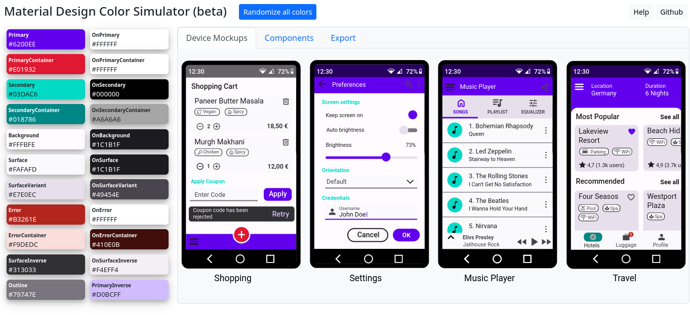
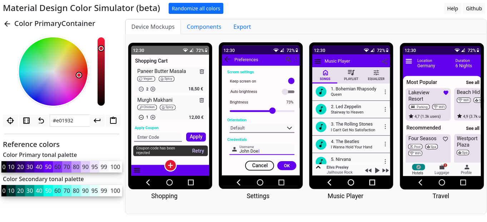

# MaterialColorSimulator
[MaterialColorSimulator](https://mettyw.github.io/MaterialColorSimulator/) is a simulator for the Android Material Design color system. It lets you edit, preview and export a Material Design color theme for Android.

Note: Currently work in progress: results are usable but not fully accurate.

## Usage

https://mettyw.github.io/MaterialColorSimulator/

## Screenshots

## Features
* Use <em>Randomize all</em> button to randomize all colors
* Or click a color swatch to select a color
* Color picker
  * Press <em>Locate color</em> button to make corresponding UI components flash
  * Press <em>Random color</em> button on each color
  * Press <em>Reset color</em> button to revert change
  * Use the Picker to select a color
  * Use Tonal Palette as reference
  * Click an item on the Tonal Palette to assign that color
* Main section
  * Use <em>Device Mockups</em> tab to preview color theme on mobile app mockups
  * Use <em>Components</em> tab to preview color theme on components
  * Click on UI component to make corresponding color swatch flash
  * Use <em>Export</em> tab to obtain android colors.xml and themes.xml file content
  * Use <em>Import</em> tab to load a theme from android colors.xml and themes.xml file content

## How does it work?

See [DESIGN.md](./DESIGN.md).

## Feedback & Contributions
Very welcome!

## License
AGPL-3.0 license